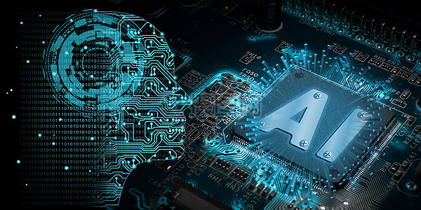

<!-- _coverpage.md -->

* **语言与基础：Python、数学与线性代数、特征工程**

* **数据结构与算法：链表、队列、栈、树、图、排序与搜索**

* **库的使用：Pandas、Numpy、Matplotlib、Seaborn、Feature Selector、MySQL、Pytorch、Tensorflow**

* **机器学习：线性回归、逻辑回归、贝叶斯、决策树与随机森林、XgBoost、GBDT、SVM、聚类算法**

* **深度学习：深度前馈神经网络、BP算法、CNN卷积神经网络、RNN循环神经网络、Transformer、CTR模型、图神经网络**

* **扩展：半监督学习、EM算法、最大熵算法、隐马尔可夫模型、概率图模型、边际概率推断、强化学习、迁移学习、主动学习**

[GitHub](https://github.com/BoshengLiu)
[Get Started](readme.md)

