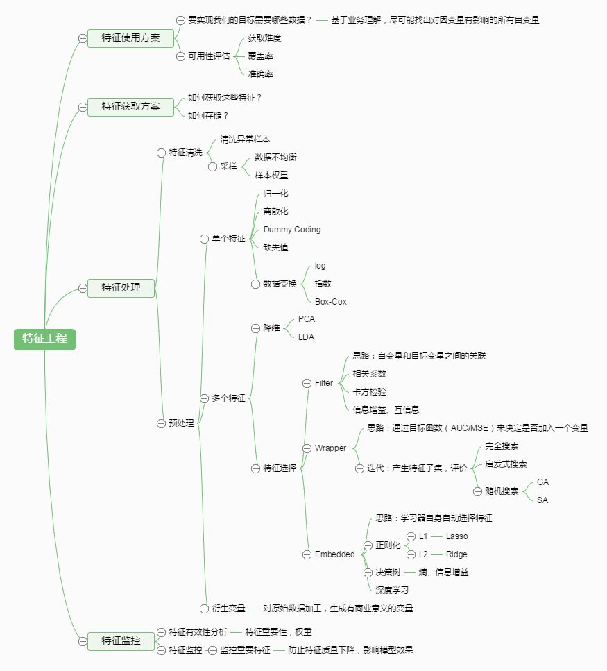

<!--
    作者：刘博生
    email: boshengliu.sty0@gmail.com
**  本文档可用于个人学习目的，不得用于商业目的  **
-->

# 数据工程

&#8195; 现实世界中数据大体上都是不完整，不一致的脏数据，无法直接进行数据挖掘，或挖掘结果差强人意。为了提高数据挖掘的质量产生了数据预处理技术。 

&#8195; 数据预处理有多种方法：数据清理，数据集成，数据变换，数据归约等。这些数据处理技术在数据挖掘之前使用，大大提高了数据挖掘模式的质量，降低实际挖掘所需要的时间。

&#8195; 数据的预处理是指对所收集数据进行分类或分组前所做的审核、筛选、排序等必要的处理，又称特征工程。

# 目录

本文共4个部分，分别为：

* 数据探索
* 特征工程
* 模型选择
* 数据降维

# [数据探索](/data_project_notes/chapter/data_explore.md)   
# [特征工程](/data_project_notes/chapter/feature_selection.md)    
# [模型选择](/data_project_notes/chapter/model_selection.md)    
# [数据降维](/data_project_notes/chapter/data_dimensionality_reduction.md)

**email: boshengliu.sty0@gmail.com** 
